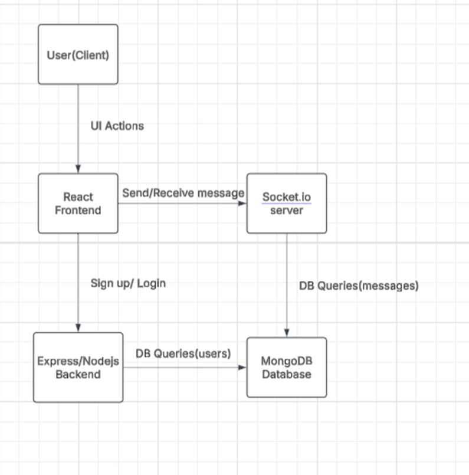
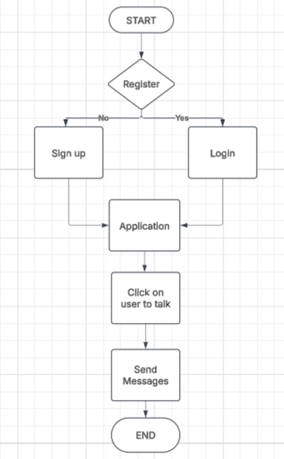

# Real-Time One-to-One Chat Application

Assignment: A full-stack real-time chat app with one-to-one messaging, built with React (frontend), Node.js/Express (backend), Socket.IO, and MongoDB. The app is fully responsive and works on desktop and mobile devices.


## Features
- **One-to-one private chat** 
- **Real-time messaging** with Socket.IO
- **User authentication** (sign up & login)
- **Typing indicators**
- **Online status**
- **Responsive UI**: mobile sidebar with hamburger menu, desktop sidebar always visible
- **Recent chats**: most recently selected user appears at the top


## Prerequisites
- [Node.js](https://nodejs.org/) (v16 or later recommended)
- [npm](https://www.npmjs.com/) (comes with Node.js)
- [MongoDB](https://www.mongodb.com/) (local or Atlas)


## Getting Started

### 1. **Clone the repository**
```bash
git clone <your-repo-url>
cd <your-project-folder>
```

### 2. **Start the MongoDB server**
- Make sure MongoDB is running locally on `mongodb://localhost:27017/ChatApp` (or update the URI in `server/config/db.js` if needed).

### 3. **Install dependencies**
#### Server
```bash
cd server
npm install
```
#### Client
```bash
cd ../client
npm install
```

### 4. **Run the application**
#### Start the backend server
```bash
cd ../server
npm start
```
- The backend will run on [http://localhost:5000](http://localhost:5000)

#### Start the frontend React app
```bash
cd ../client
npm start
```
- The frontend will run on [http://localhost:3000](http://localhost:3000)

### 5. **Open the app**
- Go to [http://localhost:3000](http://localhost:3000) in your browser.
- For one-to-one chat, open two browser windows or devices and log in as different users.

---


## Project Structure
```
root/
  client/    # React frontend
  server/    # Node.js/Express backend
```


---

## Architecture & Flow of the Real-Time Chat Application

### Overview
This is a full-stack real-time chat application that allows users to sign up, log in, and communicate privately with other users in real-time. It uses:
- **Frontend:** React
- **Backend:** Node.js with Express
- **Real-time Communication:** Socket.IO
- **Database:** MongoDB (via Mongoose)

### Architecture


### UserFlow



### Component Breakdown
**Frontend (React)**
- Provides UI for login, registration, chat, and user list.
- Establishes a WebSocket connection with the server using socket.io.
- Displays typing indicators, online status, and chat messages.
- Responsive UI adapts to desktop and mobile views.

**Backend (Node.js + Express)**
- Handles REST API routes for user registration, login, and fetching user/chat data.
- Establishes WebSocket connections via Socket.IO for real-time messaging.
- Uses mongoose to interact with MongoDB for storing user data and messages.

**Database (MongoDB)**
- Stores:
  - User data (username, hashed password)
  - Chat messages (sender, receiver, timestamp, content)

### Application Flow
**Authentication**
1. User signs up or logs in.
2. Passwords are securely hashed using bcrypt.
3. On successful login, the client is authenticated.

**WebSocket Connection**
1. After login, the client connects to the server via Socket.IO.
2. Server tracks connected users and their socket IDs.

**One-to-One Chat**
1. User selects a contact → A chat window opens.
2. Messages are sent via Socket.IO.
3. Server receives the message and:
   - Saves the message to MongoDB.
   - Emits it to the receiver if they're online.

**Typing Indicator & Online Status**
- When a user types, a typing event is emitted.
- Server broadcasts it to the corresponding receiver.
- Online users are tracked with active socket connections.

### Folder Structure Summary
```
root/
|--- client/     # React frontend
|    |--- src/
|    |--- public/
|--- server/     # Node.js backend
|    |--- models/      # Mongoose schemas
|    |--- routes/      # Auth & chat APIs
|    |--- socket/      # Real-time logic
|    |--- config/      # DB connection
```

### Scalability & Future Enhancements
- Add JWT authentication
- Add group chat support
# Chat-Application
